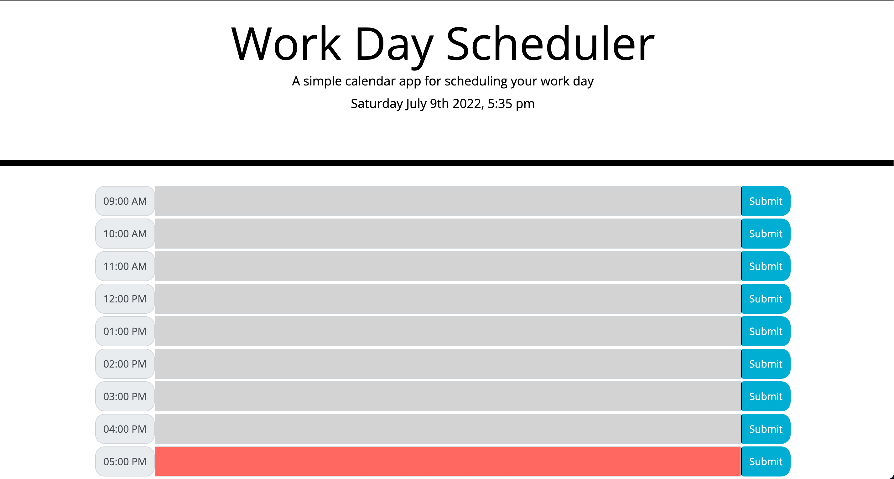
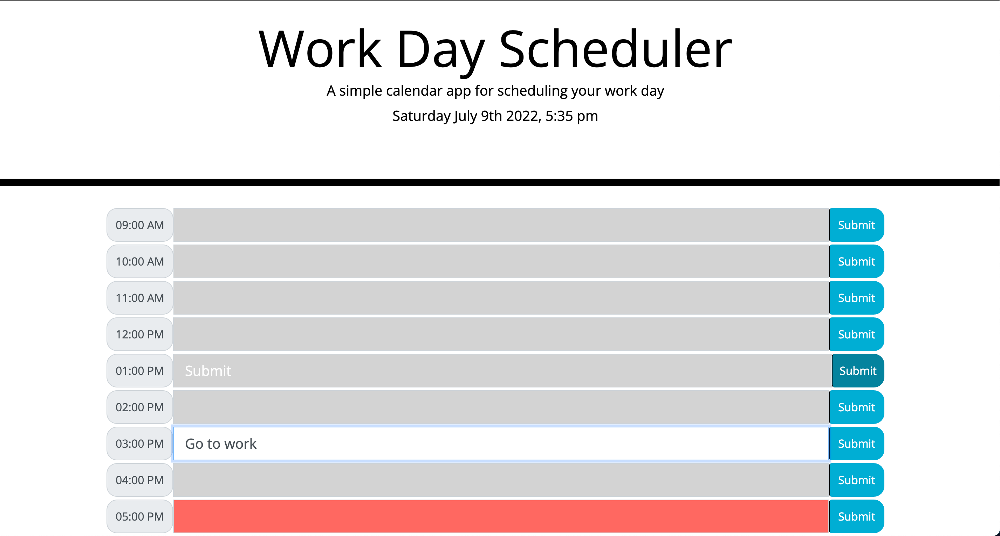

# Week_five_challenge
Day Planner
# Day-Planner
Homework-5 Day-Planner
## Jamie Morris Homework-5 Code Quiz

* ['Day-Planner GitHub']()
* ['Day-Planner GitHub IO']()

### Summary
* HTML and CSS and Javascript documents create a day planner with an eight-hour work day
* The task manager aspect saves entries to local storage
* This project emphasizes the use of using Javascript to save and retrieve data from local storage
* This project utilizes the use of moment.js for time calculation and formatting  conversion 

### This project has the following features: 
* A header with local time that updates live
* Seven Input Entries
* A Save button that saves items to local storage
    * Attribute changes for hour by hour time tracking 
    * Gray is past the current hour
    * Red is on the current hour
    * Green is before the current hour
    
### Psuedo code:  
* Find out of Moment.js needs further installation
* Start with Document onload
* Look up Javscript Calendar, write steps down and find matching Jquery methods
    ** Needs start time
    ** Needs end time
    ** Needs current time  
    ** Needs to compare each hour to current time, and determine if it is 
    ** Current time is always going to be more than start time
    ** Current time is always going to be less than end time
    
### This project has script features of:
* Moment.js for local time, current time, and time conversion for individual hours
* Appended text to HTML for hour time
* If, if/else statement to compare time with the current time 
* Appended attributes for color current time 
* An event listener for the save buttons to save to local storage

### This project features responsive design using a Bootstrap layout
### Has responsive layout for: 
** Small devices (landscape phones, 576px and up)
** Medium devices (tablets, 768px and up)
** Large devices (desktops, 992px and up)
** Extra large devices (large desktops, 1200px and up)

### To Execute File:
> Open in browser

### Features: 
* One HTML Pages
    * Index.html 
* One CSS Page
    * Styles.css
        * Contains styling for changing attributes and buttons
* One Javascript Page
        * Contains: 
        * Variables, including arrays and time conversion 
        * Event listeners
        * if/else if statements
        * For Loops
        * Functions 
        * Local Storage set and get 
